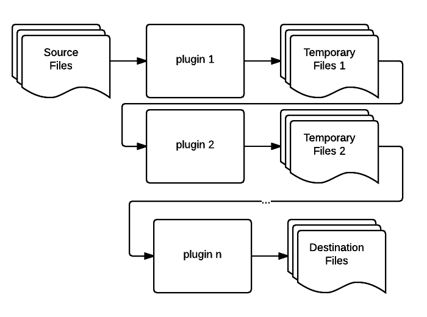

% フロント開発をがんばるためにGulpとGruntに入門してみた
% Shou Takenaka
% Nov 24, 2015

# Table of Contents
* Gulpとは
* Gulpの基本
* Gruntとの比較
* まとめ

# Gulpとは
* Node.jsで動くビルドツール (The streaming build system)

# ビルドツール
* システムをリリースするのに必要なタスク（コンパイル、リンク、静的解析、テスト、デプロイ、etc...）の
  実行をアシストしてくれるツール
* GNU Make、Ant、Gradle、MSBuild、Rake、Grunt、Gulp、etc...

# タスク定義と実行
* タスクはgulpfile.jsに定義
* JavaScriptで書く
* gulpコマンドでタスク実行

# タスク定義と実行
gulpfile.js
```
var gulp = require("gulp");

gulp.task("hello", function() {
    console.log("Hello Gulp !!");
});

gulp.task("default", ["hello"]);
```

実行すると
```
$ gulp
Hello Gulp !!
```

# Gulp API (1)
* **gulp.task(name, deps, fn)**: タスク定義
    * name: タスク名
    * deps: 依存タスク
    * fn: タスクの処理内容

# 少し本格的なタスク
```
var gulp = require("gulp");
var uglify = require("gulp-uglify");

gulp.task("default", function() {
  gulp.src("foo.js")
    .pipe(uglify())
    .pipe(gulp.dest("dest"));
});
```

# pipe?
* どこかで見たことある
* **|** シェルのこれ
* `gulp.src() | uglify() | gulp.dest()` のようなイメージ

# Gulpの動作イメージ


# Gulpの動作イメージ
* プラグインをpipeでチェイン
* pipeで徐々に加工していって目的の出力を得る
* UNIX的な考え方で処理を書ける
* Node.js のStream API

# Gulp API (2)
* **gulp.src(globs)**: 入力ファイルを取得
    * globs: 入力ファイルのパターン（src/**/*.jsみたいに書ける）

# Gulp API (3)
* **gulp.dest(path)**: ファイルへ書き込み
    * path: 出力先ディレクトリ

# 変更監視
* ファイルの変更監視もできる
* 特定のパターンにマッチするファイルが変更されたら
    * 特定のタスクを実行
    * コールバック関数を実行

# 変更監視
```
gulp.watch("src/**/*.js", ["build"]);

gulp.watch("src/**/*.js", function(event) {
    console.log("File " + event.path + " was changed.");
});
```

# Gulp API (4)
* **gulp.watch(glob, tasks), gulp.watch(glob, fn)**: 変更監視
    * glob: 監視対象のファイルのパターン
    * tasks: 変更時に実行したいタスクリスト
    * fn: 変更時に実行したいコールバック関数

# 基本的には以上
* 4つのGulp API+プラグインでタスクを作っていく
* Webアプリの開発に必要になりそうなものは大抵プラグインがある  
  **→ 作る前に探す**

# Gruntとの比較
* 同じくNode.jsで動くビルドツール Grunt と比較してみる

# 基本的な書き方
Gruntfile.js
```
module.exports = function(grunt) {
    grunt.registerTask("hello", "description", function() {
        grunt.log.writeln("Hello Grunt !!");
    });
 
    grunt.registerTask("default", ["hello"]);
};
```

# ちょっと複雑な例
```
module.exports = function(grunt) {
    grunt.loadNpmTasks("grunt-contrib-uglify");
    grunt.initConfig({
        uglify: {
            target1: {
                src: "foo.js",
                dest: "foo.min.js"
            }
        }
    });
    grunt.registerTask("default", ["uglify"]);
};
```

# Gruntの動作イメージ


# Gruntの動作イメージ
* プラグインで入力ファイルを処理して、結果をファイルに出力
* 処理結果をテンポラリファイルに出力し、後続タスクでそれを読み込んで別の処理... を繰り返して、最終目的の出力を得る
* プラグインの動作は設定で調整

# GulpとGruntの比較
* コードベースのGulp、設定ベースのGrunt
    * Gulpはプラグインを組み合わせて「どうやって目的の出力を得るか」をコードで記述
    * Gruntはプラグインに対して「何から何を出力するか」を設定ベースで記述

# GulpとGruntの比較
* プラグインの粒度が違う
    * Gulpのプラグインは単機能
        * Gulp plugin guideline says "plugin should only do **one thing**".
        * プラグインを組み合わせてタスクを作る
    * Gruntはプラグイン＝タスク

# GulpとGruntの比較
* Gruntは遅いらしいけど本当？
    * Gruntでプラグインをつないで処理する場合、プラグイン毎にディスクI/Oが発生
    * Gulpはインメモリで処理できるのでその分早い
    * ただ、トータルでどっちが早いかは状況(使ってるプラグインなど)による
    * Grunt next version (0.5) では、Gulpと同じようにディスクI/Oなしでタスクの入出力をつなげるようになる

# GulpとGruntの比較
* 先発のGruntの方がユーザーベースが大きい？
    * Gulp:  1,595,761 DL in last month
    * Grunt: 1,495,772 DL in last month

# 結局どっちを使う？
* できることはどっちも変わらない
* 一般論でどっちがいい、とは言い難い
    * コードベースと設定ベース、どっちがプロジェクトに適しているかという話

# 我々はどっちを使う？
* コードベースで手続きが書いてある方が、どういう順番で何をやっているのかわかりやすい
* 単機能の処理をパイプでつないでいくという思想がしっくりくる
* 必要そうなプラグインは一通り揃ってる

↓

**ということでGulp使います**
